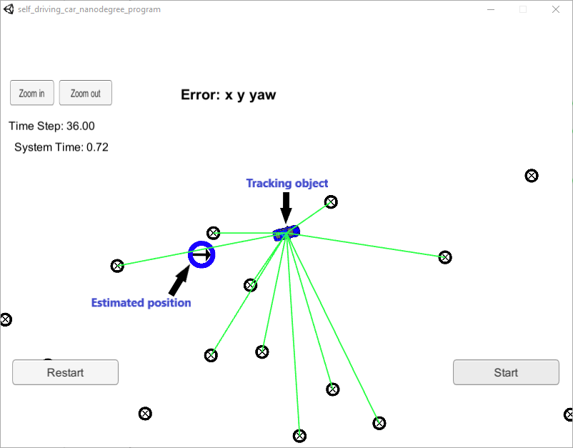

# Particle Filter

## Introduction

This project aim to implement a 2 dimensional Particle Filter in C++ to estimate the state of a moving object based on noisy lidar and radar measurements. This Udacity simulator used in this project can be downloaded [here](https://github.com/udacity/self-driving-car-sim/releases). The communication between UKF and simulator is based on [uWebSockets](https://github.com/uNetworking/uWebSockets).

## Basic Build Instructions
1. Clone this repo.
2. Make a build directory: `mkdir build && cd build`
3. Compile: `cmake .. && make` 
   * On windows, you may need to run: `cmake .. -G "Unix Makefiles" && make`
4. Run it: `./particle_filter `

Alternatively some scripts have been included to streamline this process, these can be leveraged by executing the following in the top directory of the project:

1. ./clean.sh
2. ./build.sh
3. ./run.sh

## Results ([click to video](https://youtu.be/vVMY0wCW0Js))
